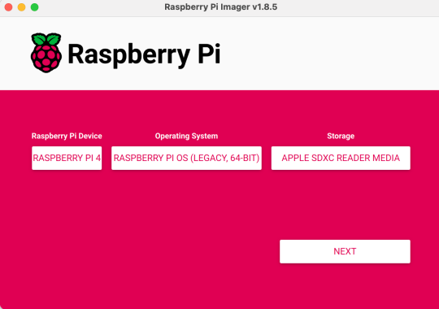
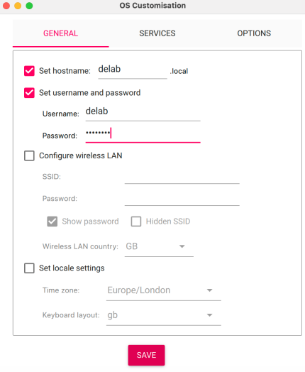
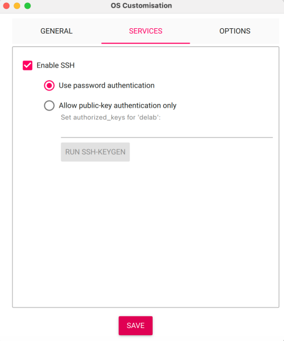

# RPI4B Deployment Guide

## (1/3) Bill of materials

- Raspberry Pi 4 Model B, 2GB
- RPI power supply USB-C 5.1V/3A, UK White
- Pibow Coupe 4 Ninja Case for Raspberry Pi 4
- Verbatim 16GB microSD, Class10, UHS 1, U1 (I do not recommend this exact SD card, you can use other 16GB microSD card)
- USB to Bluetooth 5.0 Adapter -10m Class2, StarTech
- 10ft USB 2.0 extension cable A to A M/F, StarTech

## (2/3) Hardware setup

### 2.1 Flash the SD Card using RPI Imager
- Select Raspberry Pi 4, Raspberry Pi OS (Legacy, 64-bit), and your new 16GB SD card to flash the OS as shown in image below



- Configure OS Customisation's General tab, and Service tab as shown in the images below




- Apply OS Customisation when flashing


### 2.2 Hardware Assembly
1. Plug the SD card into the RPI4B
2. Plug the USB extension cable with USB Bluetooth dongle into RPI's non-blue USB port
3. Connect the USB-C power cable to the RPI4B to boot it up
4. Connect mini-HDMI output 1 of the RPI to a monitor to see the desktop

### 2.3 Network Setup
1. Plug in the ethernet cable to RPI
2. Prepare your camera in the upper-right corner of the RPI desktop
3. When ethernet connects, you will see the IP address of the RPI

### 2.4 SSH Access
Connect via SSH from another computer in the same local network:

**Windows PowerShell:**
```bash
ssh <username>@<ip-address>
# Example:
ssh delab@172.24.243.89
```

Enter `yes` when prompted, then type the password you set during OS configuration.

You should see a prompt like: `<username>@<username>: ~ $` (example: `delab@delab: ~ $`)

## (3/3) Software setup

### 3.1 Clone the Repository

```bash
cd ~
mkdir repos
cd repos
git clone https://github.com/erlichlab/optogrid-manager.git
cd ~/repos/optogrid-manager
git checkout stable-release-spain
```

### 3.2 Automated Setup (Recommended)

```bash
chmod +x ~/repos/optogrid-manager/rpi4b_setup/rpi4b_setup.sh
source ~/repos/optogrid-manager/rpi4b_setup/rpi4b_setup.sh
```


<details>

<summary> Manual Setup (Alternative) </summary>

If you prefer to configure manually or troubleshoot specific components, follow the steps below.


### 3.2 Install Python 3.12.4

#### Install pyenv
```bash
curl https://pyenv.run | bash
```

#### Add pyenv to .zshrc
```bash
cat >> ~/.zshrc <<'EOF'
export PYENV_ROOT="$HOME/.pyenv"
export PATH="$PYENV_ROOT/bin:$PATH"
eval "$(pyenv init --path)"
eval "$(pyenv init -)"
eval "$(pyenv virtualenv-init -)"
EOF
```

#### Restart Terminal
```bash
source ~/.zshrc
```

#### Install Python Dependencies
```bash
sudo apt update
sudo apt install -y \
  build-essential \
  curl \
  git \
  make \
  zlib1g-dev \
  libssl-dev \
  libbz2-dev \
  libreadline-dev \
  libsqlite3-dev \
  libffi-dev \
  libncursesw5-dev \
  xz-utils \
  tk-dev \
  libxml2-dev \
  libxmlsec1-dev \
  liblzma-dev
```

#### Install Python 3.12.4
```bash
pyenv install 3.12.4
```
*Note: This will take a while to complete.*

#### Set Local Python Version
```bash
pyenv local 3.12.4
```

#### Verify Installation
```bash
python3 --version
# Should output: Python 3.12.4
```

### 3.3 Create Virtual Environment

```bash
python3 -m venv venv
```

### 3.4 Install Python Dependencies

```bash
pip install -r requirements.txt
pip install -r requirements-rpi.txt
```

*Note: `requirements-rpi.txt` is only needed if you are deploying on RPI and need GPIO trigger support.*

### 3.5 Install Node.js

```bash
sudo apt update
sudo apt install -y nodejs npm
```

### 3.6 Enable VNC
```bash
sudo raspi-config nonint do_vnc 0
```

### 3.7 Setup Auto-start Scripts

Make startup scripts executable:
```bash
chmod +x ~/repos/optogrid-manager/rpi4b_setup/start_og.sh
chmod +x ~/repos/optogrid-manager/rpi4b_setup/start_dash.sh
```

Create autostart desktop files:

**File: `/home/delab/.config/autostart/og.desktop`**
```
Exec=lxterminal --working-directory=/home/delab --command="/home/delab/repos/optogrid-manager/rpi4b_setup/start_og.sh"
```

**File: `/home/delab/.config/autostart/dash.desktop`**
```
Exec=lxterminal --working-directory=/home/delab --command="/home/delab/repos/optogrid-manager/rpi4b_setup/start_dash.sh"
```

### 3.8 Disable Internal Bluetooth

To use the USB Bluetooth adapter instead of the RPI's internal Bluetooth:

```bash
grep -q "dtoverlay=disable-bt" /boot/firmware/config.txt || echo "dtoverlay=disable-bt" | sudo tee -a /boot/firmware/config.txt
```

### 3.9 Enable Bluetooth

```bash
sudo rfkill unblock bluetooth
sudo systemctl start bluetooth
bluetoothctl power on
sudo reboot
```
</details>

### 3.10 Confirm software setup successful
After RPI reboot, you should see two terminal windows boot up automatically.


## Post-Deployment

After the system reboots successfully, the OptoGrid Manager should be running with:
- The headless backend service (`start_og.sh`)
- The dashboard server (`start_dash.sh`)

Both services will automatically start in their own terminal windows.

## Notes for Production

For product deployment:
- The SD card should be pre-flashed with the working software image
- The USB Bluetooth dongle should be connected and tested
